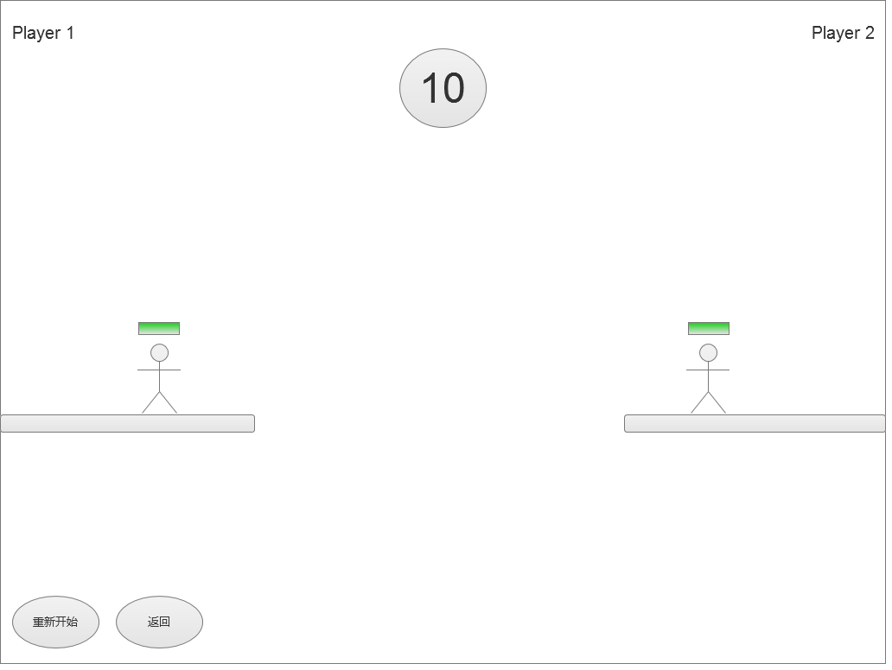

客户端
======

由于该游戏是基于 __HTML5__ 技术制作，没有独立的客户端载体，游戏将运行在支持 __HTML5__ 相关特性的浏览器中，因此此处客户端实为运行于浏览器中的游戏界面。

## 界面预览

### 启动闪屏

### 欢迎界面

### 模式选择

### 游戏初始化

### 回合开始

### 攻击开始

### 攻击中

### 回合结束

### 游戏结束

